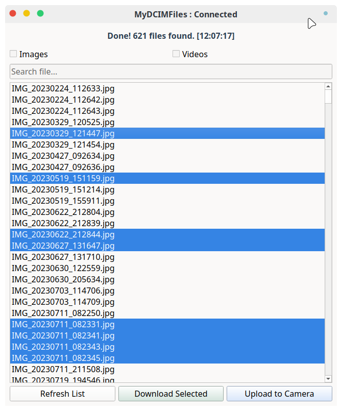

# MyDCIMFiles

A minimalist, lightweight MTP transfer utility specifically designed for FreeBSD to quickly download and upload media files from the `DCIM/Camera` directory on Android devices.

Unlike general-purpose MTP file browsers, which can be slow and bloated due to recursive scanning and thumbnail generation, **MyDCIMFiles** does exactly one thing and does it well: safely transferring your photos and videos using a fast, non-blocking sequential queue.

---

## Features

- **Fast Scanning**  
  Lists files instantly by targeting only the `DCIM/Camera` folder.

- **Filtering & Search**  
  Quick checkboxes for Images/Videos and a real-time search filter.

- **Non-Blocking UI**  
  Uses a custom `QTimer` queue system so the user interface never freezes during multi-file transfers on X11/Wayland.

- **Clean CLI Logging**  
  Outputs clear timestamps and transfer status directly to the terminal.

- **Safe Uploads**  
  Asks for confirmation before overwriting any existing file on the device.

---

## Prerequisites

Before running the application, make sure you have the required dependencies installed on your FreeBSD system.

Install them via `pkg`:

```bash
su - root -c "pkg install android-file-transfer"
su - root -c "pkg install python3 py311-qt6-pyqt"
```

> **Note:**  
> Adjust the Python/PyQt version package suffix (`py311-`) based on your current FreeBSD repository defaults.

---

## How to Use

1. Connect your Android device via USB.
2. Enable **File Transfer (MTP)** mode on your Android device.
3. Clone or download this repository.
4. Run the application from your terminal:

```bash
python my_dcim_files.py
```

## Screenshot


---

## License

This project is licensed under the **2-Clause BSD License**.  
See the `LICENSE` file for details.
